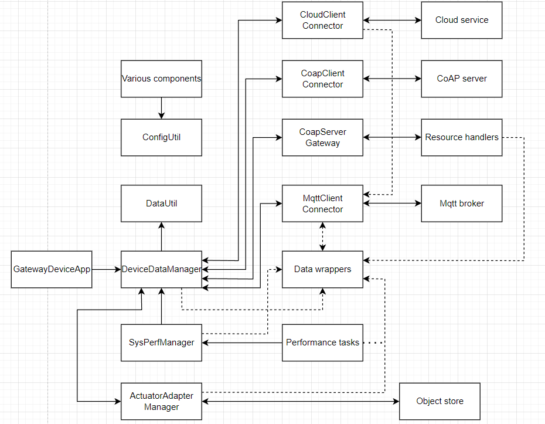
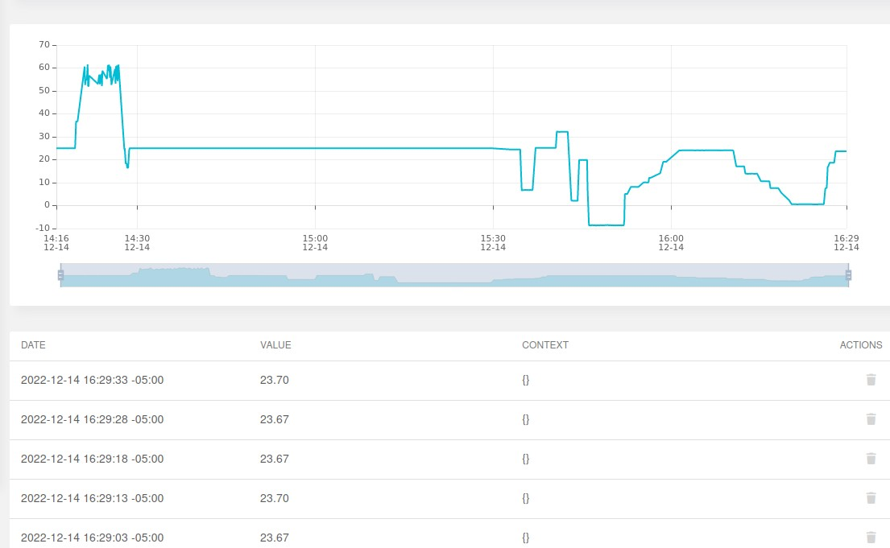

# Lab Module 12 - Semester Project - Final Write-up

NOTE: Be sure to implement all the Lab Module 12 requirements listed at [Lab Module 12](https://github.com/orgs/programming-the-iot/projects/1#column-10488565).

Smart Home Management System

## Description

Describe your idea in 1 paragraph (at least 2 or 3 sentences).

In Final Project, I decide to monitor my apartment about Humidity, Temperature and Pressure.
Constrained Device Sensor measures indoor temperature, humidity and pressure, and Actuator is 
used to remind me that if a certain value falls below a threshold after analyzing sensor data ,which is transformed under CoAP to the GDA and GDA do some action under MQTT to the top, by cloud tier, first make an alert and then automatically react, such as air conditionor on and off.

## What - The Problem 

What problem did you tackle and why does it matter? Write 1 to 2 paragraphs in response.

The main problem I want to solve is temperature detection, because it is coming to winter, the temperature is very low and I have poor sleep quality, if the air conditioner can be turned on in the middle of the night when it is very cold, I will probably be able to sleep well Sleep. The humidity is actually checked after the air conditioner is turned on. Pressure measuring is to make sure whether temperature will influence pressure and LED is using to warning if pressure is too high/low. Because when the indoor temperature increases, the humidity may drop, and the actuator can turn on the humidifier, which further improves the quality of my sleep.

## Why - Who Cares? 

Why do you care about this particular problem? Write 1 to 2 paragraphs in response.

Getting quality sleep isn't just for me, it's important for everyone. A good night's sleep can improve a person's productivity the next day. The environment people stay in plays an important role. People won't get a deep sleep if they are breating cold and dry air.
If an actuator can help people to detect and conntrol these, people will do more what they are looking forward or concentrate on, which means it will improve our effectivity and living happiness.

## How - Expected Technical Approach

Write 1 to 2 paragraphs describing the outcomes you achieved.

For data transfer between CDA and GDA, I choose to use the connectionless based CoAP transport protocol. In the case I described, GDA may only need to handle the POST and GET methods; and CDA not only uses the PUT method for GDA, but also uses the OBSERVER method to allow multiple CDAs in the house price to obtain the RESPONSE of GDA .

For the data transfer from GDA to CLOUD, I choose to use the MQTT transport protocol, which is a connection-oriented transport protocol used to transmit data received from CDA to CLOUD for data analysis.

I choose Ubidots as my Cloud Service Provider because this one is more convenient to trigger events and have a great powerful data analysis function. The most important reason is no credit card for Ubidots!

### System Diagram

Embed a block diagram depicting your overall design, including the CDA, GDA, and Cloud Services interactions.
Be sure to include arrows depicting data flow from one application / service to the next.

GDA UML

CDA UML

Write 1 to 2 paragraphs describing your design.

As what I have mentioned, I choose CoAP protocol between CDA and GDA and MQTT protocol between GDA and Ubidots CSP.

In CDA UML, I can generate sensor data, which including telemetry data and system performance data, from SensorGenerator.py if I enable simulate flag to true or from Sense HAT if I enable emulate flag to true. For sensor data, I focus on what it detect for, where it is, what type it is, when the sensor get the data and the most important one: what the value it is. For actuator data, I focus on the value and trigger object. And all data is under JSON format.

After this, CoAP protocol is my choice and I make CDA with power of CoAP Client. Every time when CDA get a data from the generator, it will run handleIncomingData method and then create a POST request to GDA, which is a CoAP Server, to send data a high level. Also, CoAP
Observer is a good way to get the actuate data which GDA get from the CSP. If I start CoAP Observer in CDA, CDA will always send GET actuate data request to GDA.

When CDA receive the actuate data from GDA by CoAP OBSERVER, it will run handleActuatorCommandMessage method to transform JSON to 
actuator object and show the result on the SENSE HAT.

In GDA UML, after building CoAP Server, MQTT protocol is a good way to communicate between GDA and CSP. Considering the internet security, encrytion is really essential element to keep my computer away the hacker and also protects my telemetry data and system performance data what I have detected. I will use port 8883 as my MQTT protocol communication port for building a safe connection between GDA as a MQTT client and Ubidots as a MQTT server. Every time, when GDA receive the sensor data from CDA, it will MQTT publish method to send the data to Ubidots and also use subscribe method to receive the actuator data from Ubidots for convenient.

When Ubidots get the data from GDA, I can put some trigger, like: when temperature data is lower than 18 degree, put HVAC actuator value to 1.0, which means Ubidots want HVAC actuator to "ON".

### What THREE (3) sensors and ONE (1) actuator did you use (add more if you wish)?

- CDA Sensor 1: Temperature Sensor

- CDA Sensor 2: Pressure Sensor

- CDA Sensor 3: Humidity Sensor

- CDA Actuator 1: HVAC actuator

- CDA Actuator 2: LED actuator

- CDA Actuator 3: Humidifier actuator

### What ONE (1) CDA protocol and TWO (2) GDA protocols did you implement (add more if you wish)?

- CDA to GDA Protocol: CoAP

- GDA to CDA Protocol: CoAP

- GDA to Cloud Protocol: MQTT

- Cloud to GDA Protocol: MQTT

 
### What TWO (2) cloud services / capabilities did you use (add more if you wish)?

- Cloud Service 1 (data ingress - all inputs): 

CSP: Ubidots

Input: sensor-temperature, sensor-pressure, sensor-humidity

- Cloud Service 2 (data egress - all actuation events):
  
CSP: Ubidots

Output: HVAC, LED, Humidifier

Trigger: if sensor-temperature value 
                is higher than 20, put HVAC to 1.0 -> ["ON"],
                is lower than 20, put HVAC to 0 -> ["OFF"]
        ;
        if sensor-pressure value 
            is higher than 1010, put LED to 1.0 -> ["ON"],
            is lower than 990, put LED to 1.0 -> ["ON"],
            else put LED to 0 -> ["OFF"]
        ;
        if sensor-humidity value
            is higher than 45, put Humidifier to 0 -> ["OFF"],
            is lower than 35, put Humidifier to 1.0 -> ["ON"];

## Screen Shots Representing Cloud Services

I do a 1 hour test which have at least 30 trigger...

CPS:
    Sensor:
    
    
    
    ;
    Actuator:
    
    
    
    ;    
    Event:  
    ;
    Email Alert:
    ;

### Screen Shots Representing Visualized Data

NOTE: Include (at least) TWO (2) screen shots - one showing at least 1 hour
of time-series data from the CDA, and one showing an event being triggered
that results in an actuation event sent to your GDA and then to your CDA.

dataGenerate:

CDA CoAP POST:

CDA receive Actuator:

GDA receive sensor:

GDA receive Ubidots Actuator Command:

EOF.
